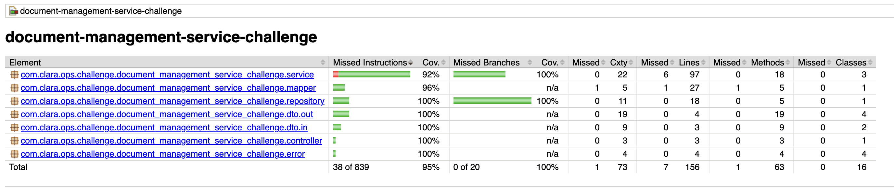

# Document Management Service — Solution

---

## Table of Contents

1. [Solution Overview](#solution-overview)
2. [Architecture](#architecture)
3. [Database Design](#database-design)
4. [Error Handling](#error-handling)
5. [Test Coverage](#test-coverage)
6. [Handling the 50MB Constraint — Trade-offs](#handling-the-50mb-constraint--trade-offs)
7. [Running the Stack](#running-the-stack)
8. [Manual Testing](#manual-testing)

---

## Solution Overview

The service exposes three REST endpoints to manage PDF documents:

| Method | Path | Description |
|--------|------|-------------|
| `POST` | `/document-management/upload` | Upload a PDF with metadata — returns `201` with no body |
| `POST` | `/document-management/search` | Search documents with optional filters and pagination |
| `GET` | `/document-management/download/{documentId}` | Get a temporary presigned download URL |

All endpoints follow the contract defined in [`docs/document-management-open-api.yml`](docs/document-management-open-api.yml).

---

## Architecture

The application follows a **layered (Controller → Service → Repository) architecture** with clear separation of concerns.

```
com.clara.ops.challenge.document_management_service_challenge/
│
├── controller/          # HTTP entrypoints — input validation, HTTP semantics only
├── service/             # Business logic — orchestration, rules, validations
├── repository/          # Data access — JPA repositories and dynamic query specs
├── entity/              # JPA entities — database model
├── mapper/              # Converters between entities and DTOs
├── dto/
│   ├── in/              # Request DTOs (records with Bean Validation)
│   └── out/             # Response DTOs (records — immutable)
├── config/              # Spring beans (MinioClient)
└── error/               # Domain exceptions (mapped to HTTP codes)
```

- **Fail-fast validation:** requests are validated at the controller boundary via `@Valid` before reaching business logic.
- **Immutable DTOs:** Java records reduce boilerplate and prevent accidental mutation.
- **Semaphore-based concurrency guard:** limits simultaneous uploads to `UPLOAD_MAX_CONCURRENT` (default: 10) to prevent resource exhaustion.
- **Presigned URLs for downloads:** MinIO serves the file directly to the client — the service only generates the URL, keeping large downloads off the service entirely.

---

## Database Design

The schema is externalized in [`docker/init-scripts/db/schema-init.sql`](docker/init-scripts/db/schema-init.sql) and applied at container startup. Hibernate is set to `ddl-auto: none`.

### Tables

**`document_schema.documents`**

| Column | Type | Notes |
|--------|------|-------|
| `id` | UUID | PK, `gen_random_uuid()` default |
| `username` | VARCHAR(255) | NOT NULL |
| `file_name` | VARCHAR(255) | NOT NULL |
| `storage_path` | VARCHAR(500) | MinIO object path |
| `file_size` | BIGINT | bytes |
| `file_type` | VARCHAR(100) | MIME type |
| `created_at` | TIMESTAMP | auto-set, NOT NULL |
| | | UNIQUE(username, file_name) |

**`document_schema.document_tags`**

| Column | Type | Notes |
|--------|------|-------|
| `document_id` | UUID | FK → documents(id) ON DELETE CASCADE |
| `tag` | VARCHAR(255) | |
| | | PK(document_id, tag) |

Tags are stored in a separate table (rather than a JSON column or comma-separated string) to allow indexed filtering via a proper `JOIN` and to enforce uniqueness of (document, tag) pairs via the composite PK.

Indexes on `username`, `file_name`, `created_at`, and `tag` cover all supported search filters.

---

## Error Handling

All errors follow a uniform JSON structure returned by `GlobalExceptionHandler`:

```json
{
  "code":      "DMS-001",
  "message":   "Document not found with id: abc-123",
  "status":    404,
  "timestamp": "2024-06-01T12:00:00"
}
```

| Code | HTTP Status | Meaning |
|------|-------------|---------|
| `DMS-001` | `404 Not Found` | The requested document does not exist |
| `DMS-002` | `409 Conflict` | A document with the same user and file name already exists |
| `DMS-003` | `413 Payload Too Large` | The uploaded file exceeds the maximum allowed size |
| `DMS-004` | `429 Too Many Requests` | The concurrent-upload limit has been reached |
| `DMS-005` | `400 Bad Request` | One or more request fields failed validation |
| `DMS-006` | `500 Internal Server Error` | An unexpected error occurred (details are logged, not exposed) |

---

## Test Coverage



### Unit Tests

| Test Class | What it covers |
|------------|----------------|
| `DocumentControllerTest` | HTTP status codes, request validation, error responses via MockMvc |
| `DocumentServiceTest` | Upload/search/download logic, duplicate detection, size limits, concurrency guard |
| `StorageServiceTest` | MinIO interactions: bucket creation, upload, presigned URL generation |
| `DocumentSpecificationTest` | Dynamic predicate construction for each filter combination |
| `DocumentMapperTest` | Entity ↔ DTO conversions, pagination metadata |
| `UploadConcurrencyGuardTest` | Semaphore acquire/release, max-concurrent enforcement |

### Integration Tests

Integration tests use **Testcontainers** to spin up real PostgreSQL and MinIO instances, covering the full request-to-database-to-storage flow without mocks. Scenarios include successful uploads, duplicate detection, file size rejection, search filter combinations, and presigned URL generation.

```bash
./mvnw verify
```

---

## Handling the 50MB Constraint — Trade-offs

The service uses **GraalVM Native Image** to stay within the 50MB container memory limit. Compiling ahead-of-time eliminates the JIT compiler, metaspace, and dynamic class-loading overhead that make a standard JVM impractical under 50MB.

For uploads, incoming bytes are written directly to a disk-backed temp file (`file-size-threshold: 0B`) so the JVM heap never holds the file body. The temp file is then streamed to MinIO via `InputStream`.

The approaches below were considered to further reduce memory pressure:

| Approach | Trade-off |
|----------|-----------|
| **Presigned PUT URL** (client uploads directly to MinIO) | Changes the API contract — requires a two-step flow (init + confirm). Client must reach MinIO directly. |
| **Reduce HikariCP pool size** (2 conns instead of 10) | Limits throughput under high concurrency; safe for low-traffic scenarios. |
| **Replace Tomcat with Undertow** | Non-blocking I/O cuts thread-stack memory but adds a dependency swap with native image compatibility risk. |
| **Spring WebFlux (reactive stack)** | Lowest per-request memory, but requires rewriting the entire stack with R2DBC — significant complexity with limited JPA feature parity. |

---

## Running the Stack

**Prerequisites:** Docker + Docker Compose, and GraalVM 22+ only if building the native image locally.

```bash
# 1. Build the native image
make build-native

# 2. Start PostgreSQL, MinIO, and the service
make run

# 3. Stop containers
make stop

# 4. Stop and remove volumes/images
make clean
```

The service is available at `http://localhost:8080` once the stack is up.

---

## Manual Testing

### Health

```bash
curl http://localhost:8080/actuator/health
```

```json
{
  "status": "UP",
  "components": {
    "memory": {
      "status": "UP",
      "details": {
        "used": "18 MB",
        "free": "12 MB",
        "total": "30 MB",
        "max":   "42 MB",
        "usagePercent": "42.9%"
      }
    },
    ...
  }
}
```

The `memory` indicator reports `DOWN` when heap usage exceeds 90% (configurable via `health.memory.critical-threshold`).

### Upload a document

```bash
curl -X POST http://localhost:8080/document-management/upload \
  -F "file=@/path/to/file.pdf;type=application/pdf" \
  -F "user=alice" \
  -F "fileName=report.pdf" \
  -F "tags=finance" \
  -F "tags=2024"
```

Expected: `201 Created` with no body.

### Search documents

```bash
curl -X POST http://localhost:8080/document-management/search \
  -H "Content-Type: application/json" \
  -d '{"user": "alice", "tags": ["finance"]}'
```

### Download a document

```bash
curl http://localhost:8080/document-management/download/{documentId}
```
